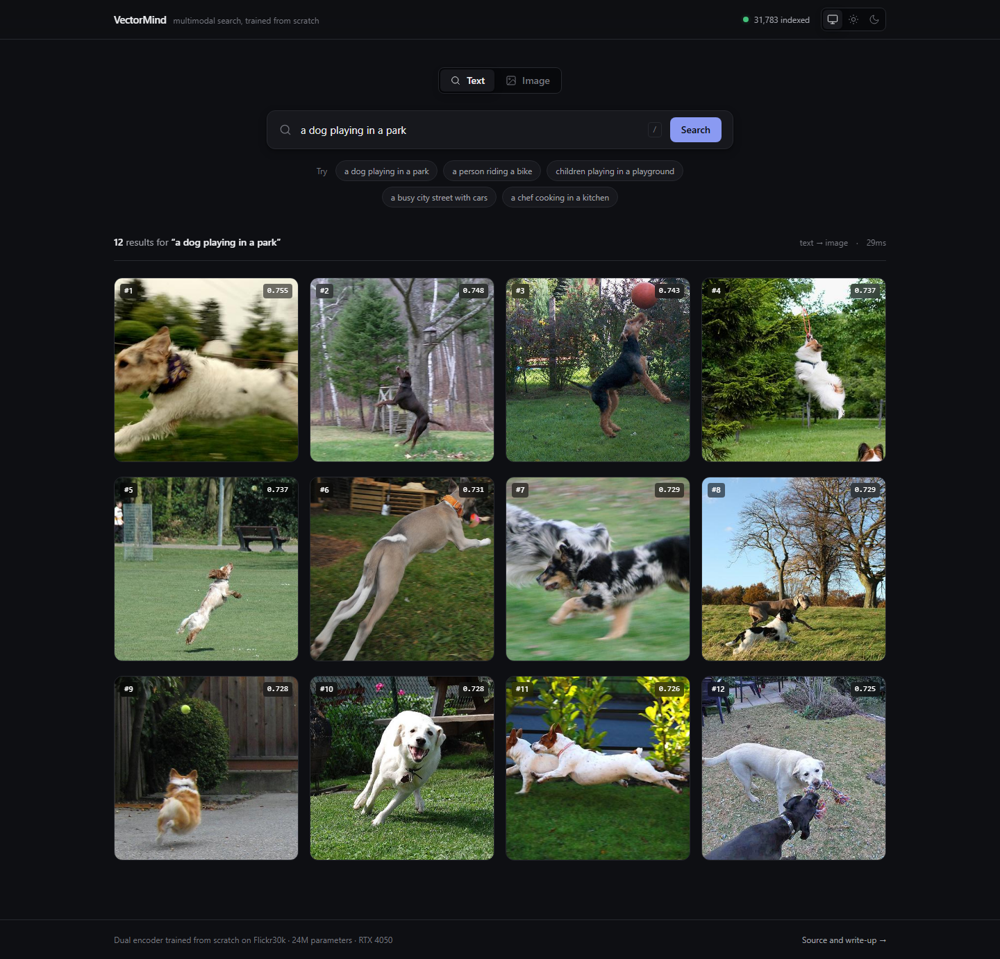
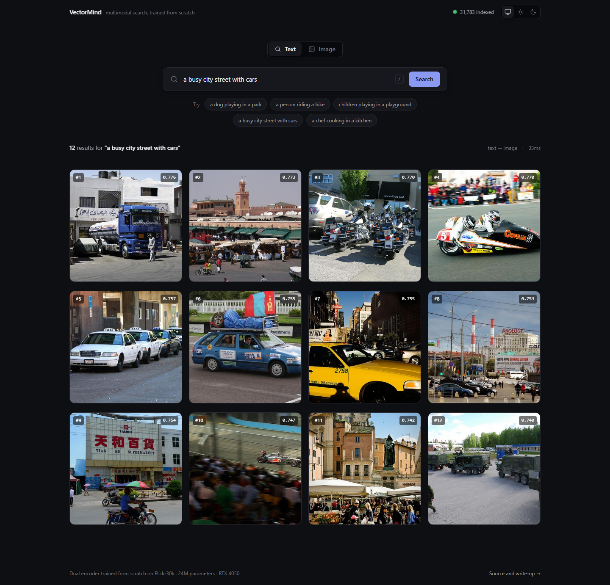
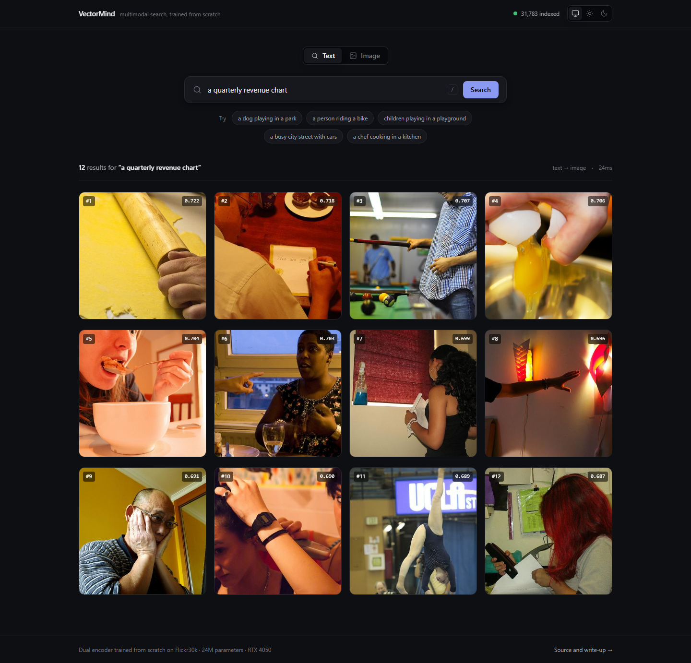
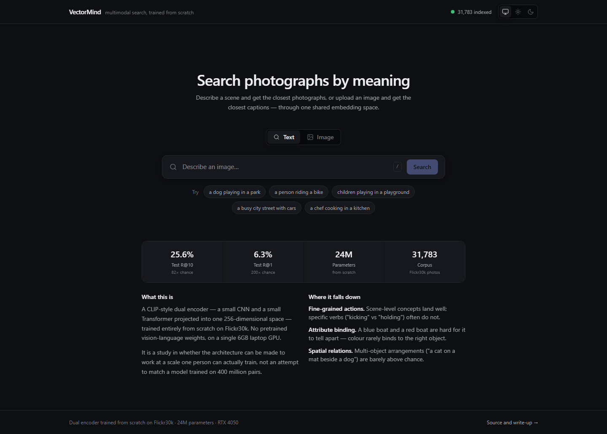

# VectorMind

A research-grade multimodal semantic search platform that learns a
shared embedding space for images and text using contrastive learning
— trained **entirely from scratch**, no pretrained CLIP/OpenCLIP
weights, on a single 6GB laptop GPU.

> This is a portfolio/research project, not a reproduction of the CLIP
> paper. It is not trying to match published CLIP numbers — it's
> trying to demonstrate a correct, debuggable, well-documented ML
> engineering pipeline end to end. See [ROADMAP.md](./ROADMAP.md)'s
> "Realistic Success Definition" for the honest framing.

---

## Vision

Most public CLIP-style demos fine-tune or wrap an already-pretrained
model. VectorMind instead builds both towers — the image encoder and
the text encoder — from scratch, under a hard hardware constraint
(RTX 4050, 6GB VRAM), and treats every architectural decision as
something that has to be *justified against what's actually trainable
at this scale*, not against what a 400M-pair-scale system would do.
See [PROJECT_CONTEXT.md](./docs/PROJECT_CONTEXT.md) for the full motivation.

## Features

- **Dual-encoder architecture** — independently swappable image tower
  (small CNN), text tower (small Transformer), and projection heads
- **Contrastive training from scratch** — symmetric InfoNCE loss with a
  learnable, clamped logit scale, trained on in-batch negatives. A
  MoCo-style memory queue is implemented and **disabled**: a controlled
  A/B showed it halving retrieval quality and collapsing the embedding
  space, because this implementation borrowed MoCo's queue without its
  momentum encoder ([KNOWN_ISSUES.md](./docs/KNOWN_ISSUES.md) §11)
- **Cross-modal retrieval** — image → text and text → image search
- **Full serving stack** (Phase 6+) — FAISS vector index, FastAPI
  backend, React/TypeScript frontend, Dockerized deployment with CI

## Results

Trained from scratch on Flickr30k, evaluated on a held-out test split of
3,179 images / 15,895 captions. Every figure is regenerable with
`python scripts/generate_reports.py`.

| Direction | K | Measured | Chance | vs chance |
|---|---|---|---|---|
| image → text | 1 | 7.64% | 0.031% | **243×** |
| image → text | 5 | 20.79% | 0.157% | **132×** |
| image → text | 10 | **28.91%** | 0.314% | **92×** |
| text → image | 1 | 5.98% | 0.031% | **190×** |
| text → image | 5 | 18.24% | 0.157% | **116×** |
| text → image | 10 | 26.22% | 0.315% | **83×** |

Chance is the exact complement of drawing K non-relevant items, not the
`k/n` shortcut — which overstates it whenever an image has five valid
captions.

**Embedding health matters as much as recall here.** A contrastive model
can post respectable Recall@K while its embeddings sit in a narrow cone,
and this project shipped exactly that before catching it:

| | Phase 4 | InfoNCE only | **Current** |
|---|---|---|---|
| Test R@10 (image → text) | 19.63% | 28.91% | **28.91%** |
| Test R@10 (text → image) | 15.09% | 25.20% | **26.22%** |
| Matched − unmatched separation | 0.094 | 0.347 | **0.482** |
| Mean image–image cosine | 0.810 | 0.345 | **0.027** |
| ‖mean text embedding‖ | 0.938 | 0.621 | **0.116** |
| Grade | ANISOTROPIC | ANISOTROPIC | **HEALTHY** |

The current space grades **HEALTHY** on all three thresholds. Getting
there took two corrections, and the interesting part is that neither
cost accuracy:

1. **The memory queue this architecture was built around was causing the collapse it was added to prevent.** A controlled A/B from a single checkpoint reversed the project's own published conclusion — [KNOWN_ISSUES.md](./docs/KNOWN_ISSUES.md) §11.
2. **A uniformity term at weight 0.2** removed the residual anisotropy that remained. On the test split it cost **nothing**: image→text R@10 is identical to four significant figures, and text→image *improved* by 1.03pp — [KNOWN_ISSUES.md](./docs/KNOWN_ISSUES.md) §12, [EXPERIMENTS.md](./docs/EXPERIMENTS.md) 009.

Both grades above are reported rather than rounded up. An earlier
checkpoint's report claimed "HEALTHY" on far worse numbers, and
[docs/KNOWN_ISSUES.md](./docs/KNOWN_ISSUES.md) §1 is the write-up of how
that happened — which is why the grade here is computed by
`scripts/generate_reports.py` rather than written by hand.

## Architecture Overview

```
Image ──▶ Image Encoder ──▶ Projection Head ──▶┐
                                                  ├──▶ Shared Embedding Space ──▶ Contrastive Loss
Text  ──▶ Text Encoder  ──▶ Projection Head ──▶┘         (InfoNCE, learnable temperature)
```

Full diagrams and design rationale for every box above (and the
serving/frontend/deployment layers built on top of a trained model)
live in [ARCHITECTURE.md](./ARCHITECTURE.md).

## Technology Stack

| Layer | Technology |
|---|---|
| Model / training | PyTorch, mixed precision, from-scratch CNN + Transformer |
| Data | Flickr30k (public, ~30k images / 5 captions each) |
| Experiment tracking | Weights & Biases / TensorBoard |
| Vector index | FAISS |
| Backend API | FastAPI |
| Frontend | React, TypeScript, Tailwind CSS |
| Deployment | Docker, GitHub Actions |

Full rationale and alternatives considered for each: [TECH_STACK.md](./docs/TECH_STACK.md).

## Demo

See the [Walkthrough](#walkthrough) below for screenshots captured from
the running application, including what it looks like when a query has
no answer in the corpus.

The full stack runs in containers and has been verified end to end —
`/ready` green, 31,783 images indexed, search at 8–30ms through nginx
([docs/DEPLOYMENT.md](./docs/DEPLOYMENT.md)).

There is **no public deployment**, deliberately: a public instance would
mean re-hosting 31,783 Flickr photographs, which falls outside the
dataset's non-commercial research terms
([docs/DATASETS.md](./docs/DATASETS.md)). For a private link, the
deployment ships an [optional auth overlay](#running-it-privately).

## Installation

```bash
git clone <this-repo-url>
cd vectormind
python -m venv .venv
# Windows:
.venv\Scripts\activate
# Linux/macOS:
source .venv/bin/activate
pip install -r requirements.txt
```

GPU setup: install the PyTorch build matching your installed CUDA
version (check `nvidia-smi`, then use the correct index URL from
https://pytorch.org/get-started/locally/ — do not assume a `cu1xx` tag
without checking).

### Environment Verification

Run the verification script to confirm all dependencies are correctly
installed and CUDA is available:

```bash
python scripts/verify_env.py
```

Expected output:
```
============================================================
VectorMind Environment Verification
============================================================

Results:
------------------------------------------------------------
  [PASS] Python 3.12.10 (need 3.12.x)
  [PASS] PyTorch 2.13.0+cu126 | CUDA: True | Device: NVIDIA GeForce RTX 4050 Laptop GPU | VRAM: 6.0 GB
  [PASS] AMP (torch.autocast) works on CUDA
  [PASS] torchvision 0.28.0+cu126
  [PASS] transformers 5.14.1
  [PASS] tokenizers 0.22.2
  [PASS] faiss 1.14.3
  [PASS] cv2 5.0.0
  [PASS] PIL 12.3.0
  [PASS] fastapi 0.140.7
  [PASS] uvicorn 0.51.0
  [PASS] yaml 6.0.3
  [PASS] pytest 8.4.2
------------------------------------------------------------
ALL CHECKS PASSED
```

## Quick Start

```bash
# Run the test suite
pytest tests/ -v

# Profile the max VRAM-safe batch size on your GPU (Phase 0.2)
python scripts/profile_vram.py --config configs/profiling.yaml
```

### VRAM Profiling

The profiling script (`scripts/profile_vram.py`) empirically determines
the maximum batch size that fits in your GPU's VRAM under mixed
precision. It uses encoder dimensions representative of the planned
Phase 2 architecture (ARCHITECTURE.md §2-4) and runs a
contrastive-loss-shaped forward/backward pass.

Configuration is in `configs/profiling.yaml`:
- `use_amp: true` — mixed precision (required per CLAUDE.md §9)
- `min_batch_size` / `max_batch_size` — search bounds
- `warmup_iters` / `measure_iters` — iterations for stable measurement
- `vram_safety_margin_fraction: 0.10` — 10% headroom for memory queue,
  dataloader pinned memory, and fragmentation

Output:
- Console log with each batch size attempt
- `logs/vram_profile_results.json` — structured results
- `logs/profile_vram.log` — detailed log

**Current measured result (RTX 4050 Laptop, 6.44 GB VRAM):**
- Max safe batch size: **256**
- Peak VRAM at batch 256: **4.99 GB**
- Search method: exponential then binary search, 5.2 GB ceiling, AMP enabled
- Tensor shapes: Image `[B, 3, 224, 224]`, Text `[B, 77]`
- Encoder dims: image 512, text 256, shared embedding 256

See [ARCHITECTURE.md §6](./ARCHITECTURE.md#6-vram-constrained-batch-strategy-critical)
for full details and design rationale.

Data pipeline, training, and serving entrypoints will be documented
here as each phase lands — see [ROADMAP.md](./ROADMAP.md) for what's
implemented today versus planned.

## Repository Structure

```
vectormind/
├── src/vectormind/    → model, data, training, evaluation code
├── backend/            → FastAPI serving layer (Phase 6)
├── frontend/           → React demo UI (Phase 6.5)
├── deployment/         → Docker, docker-compose (Phase 7)
├── configs/            → all hyperparameters (never hardcoded)
├── scripts/            → one-off tooling (e.g. VRAM profiling)
└── tests/              → mirrors src/vectormind/
```

Full ownership/responsibility breakdown: [FOLDER_STRUCTURE.md](./docs/FOLDER_STRUCTURE.md).

## Frontend

React + TypeScript + Tailwind v4, built with Vite. 67KB gzipped, no
component or icon library.

The interface is deliberately quiet: a retrieval demo is mostly
photographs, and photographs supply all the colour a page needs, so the
chrome stays out of their way. Design tokens live in one block in
`src/index.css` — components reference `--surface` and `--text-primary`
rather than palette steps, so light and dark cannot drift apart.

- **Theme** — light, dark, or follow the system, applied before first paint so dark-mode visitors get no white flash
- **Loading** — skeletons shaped like the results, which hold layout instead of shifting the page when twelve images land
- **Accessible** — dialogs trap and restore focus, `/` focuses search, everything is reachable by keyboard, and `prefers-reduced-motion` is honoured
- **Honest** — every result shows its similarity score, and the idle screen states where the model fails, because a visitor who gets a mediocre result should be able to tell an out-of-domain query from a broken demo

### Development

```bash
cd frontend
npm install
npm run dev      # http://localhost:3000, proxies /search /health /images to :8000
```

### Checks

```bash
npm test          # 56 tests (vitest + testing-library)
npx tsc --noEmit  # type-check
npm run lint      # oxlint
npm run build     # production build → frontend/dist/
```

### Building the search index

The index is derived from a checkpoint and is not committed — it is
234MB, and `text_index.faiss` alone exceeds GitHub's 100MB file limit.
Build it once before serving:

```bash
python -m backend.index_builder     --checkpoint checkpoints/train/best_model.pt     --split all
```

`--split all` indexes the whole 31,783-image corpus, which is what the
demo should search. Building from the test split alone leaves 90% of
Flickr30k unreachable, so most queries have nothing relevant to match
and the model looks far worse than it is. Reported metrics are unchanged
either way — Recall@K is measured on the held-out test split by
`scripts/generate_reports.py`, which never reads this index.

### Running the full stack

```bash
# Terminal 1 — backend, also serves frontend/dist in production
python -m uvicorn backend.app:app --host 0.0.0.0 --port 8000

# Terminal 2 — dev server with HMR (optional)
cd frontend && npm run dev
```

Or in containers, which is the configuration meant for deployment —
nginx serves the SPA and proxies the API, so the whole app is
same-origin:

```bash
docker compose -f deployment/docker-compose.yml up --build
```

See [docs/DEPLOYMENT.md](./docs/DEPLOYMENT.md) for the topology, probes,
and known gaps.

## Production readiness

What is in place, and what is deliberately not.

| Area | Status |
|---|---|
| Request limits | Sliding-window rate limit, body-size guard before buffering |
| Security headers | nosniff, DENY framing, referrer and permissions policy |
| Observability | Correlation id on every response and log line, timed access log |
| Probes | `/health` (liveness) and `/ready` (readiness, names the missing artifact) |
| Failure handling | Timeouts and typed errors client-side; app starts degraded rather than crash-looping |
| Config | Every path, origin, limit and tokenizer setting in `configs/serving.yaml` |
| CI | pytest, mypy, ruff, tsc, oxlint, both Docker builds, and a deployment job that validates the Caddyfile, every compose combination, and the response headers of a running container |

**Not in the default stack:** TLS and authentication, both of which ship
as compose overlays (`docker-compose.tls.yml`, `docker-compose.auth.yml`)
and have been run locally but never against a public host.

**Not in place at all:** multi-worker deployment (the rate limiter holds
per-process state), and metrics or tracing beyond structured logs. Each
is explained in [docs/DEPLOYMENT.md](./docs/DEPLOYMENT.md#known-gaps).

## Development Roadmap

See [ROADMAP.md](./ROADMAP.md) for the complete, living phase-by-phase
plan (Phase 0 through Phase 7), including dependencies, acceptance
criteria, and current status per phase.

## Walkthrough

Every image below is a live query against the running stack — the real
model, the real 31,783-image index, captured by
`scripts/capture_screenshots.py`. Nothing here is a mockup, and rerunning
that script after a retrain regenerates the whole set.

### Text → image



*"a dog playing in a park"* — twelve results, all twelve dogs, most of
them mid-run on grass. 2.2s here because it is the first query after a
cold start; subsequent ones are 8–30ms.



*"a busy city street with cars"* — scene-level concepts like this are
what the model handles best, and what the Phase 5 qualitative analysis
predicted it would.

### What it looks like when it fails

This is the more useful screenshot.



*"a quarterly revenue chart"* — Flickr30k contains no charts, so there is
no right answer. The model returns its nearest photographs anyway, as
every embedding-based retriever does, and **the scores drop**: 0.722 at
rank 1 against 0.755 for the dog query, and a flatter curve.

That gap is why every result carries its score. A retrieval demo that
hides the number lets rank order imply a confidence the model does not
have. Showing it lets you see the difference between "found it" and
"here is the closest thing I have".

### Idle state



The example queries are not decoration — a visitor has no way to know
the corpus is Flickr30k photographs, and an out-of-domain query returning
noise reads as a broken demo rather than a mismatched question. The panel
below states the measured numbers and where the model falls down.

### Reproducing these

```bash
docker compose -f deployment/docker-compose.yml up -d
python scripts/capture_screenshots.py --base-url http://localhost:8080
```

`playwright` is a capture-time tool, not a project dependency:
`pip install playwright && playwright install chromium`.

## Running it privately

There is no public demo, and that is deliberate. A public instance would
mean publicly re-hosting 31,783 Flickr photographs, and the official
Flickr30k terms are non-commercial research/education only, with the
images themselves still under Flickr's own Terms of Use — see
[docs/DATASETS.md](./docs/DATASETS.md).

For sharing a private link instead, the deployment ships an optional
HTTP Basic auth overlay:

```bash
docker run --rm httpd:alpine htpasswd -nbB you 'a-long-passphrase' \
  > deployment/.htpasswd
cp deployment/auth.conf.example deployment/auth.conf

docker compose -f deployment/docker-compose.yml \
  -f deployment/docker-compose.auth.yml up -d
```

`/health` and `/ready` stay open so uptime checks keep working.
Credentials are gitignored. Basic auth is base64 encoding rather than
encryption, so it is only a real control behind TLS — over plain HTTP it
keeps a link out of search results, and nothing more.

## Contributing

This is currently a solo portfolio project. If you're another engineer
picking this up: read
[CLAUDE.md](./CLAUDE.md) first (the permanent engineering rules),
then [DEVELOPMENT_GUIDE.md](./docs/DEVELOPMENT_GUIDE.md) for the expected
workflow, then [ARCHITECTURE.md](./ARCHITECTURE.md) and
[ROADMAP.md](./ROADMAP.md) for current state. Conventional Commits
required (`feat:`, `fix:`, `docs:`, etc. — see CLAUDE.md §7).

## Status & Known Issues

Phases 0–6.5 are complete and verified. Phase 7 is complete except for
its last deliverable: both images build, CI is green, and the stack —
including the TLS and auth overlays — has been run end to end locally.
There is no public instance. See
[PROJECT_STATUS.md](./docs/PROJECT_STATUS.md).

Before reading the results as final, read
[docs/KNOWN_ISSUES.md](./docs/KNOWN_ISSUES.md). The headline number
(28.91% test R@10, 92× chance) is real, and as of 2026-08-25 the
embedding space behind it grades **HEALTHY** on all three thresholds
(§12) — the last open modelling problem in the project. The
duplicate-vector defect in the image index is fixed and the shipped
index rebuilt (§2). What remains open is listed there, honestly.

## License

[MIT](./LICENSE). Covers the source code only — not the Flickr30k
dataset (see [DATASETS.md](./docs/DATASETS.md)) and not any trained
checkpoints, which are not committed to this repository.